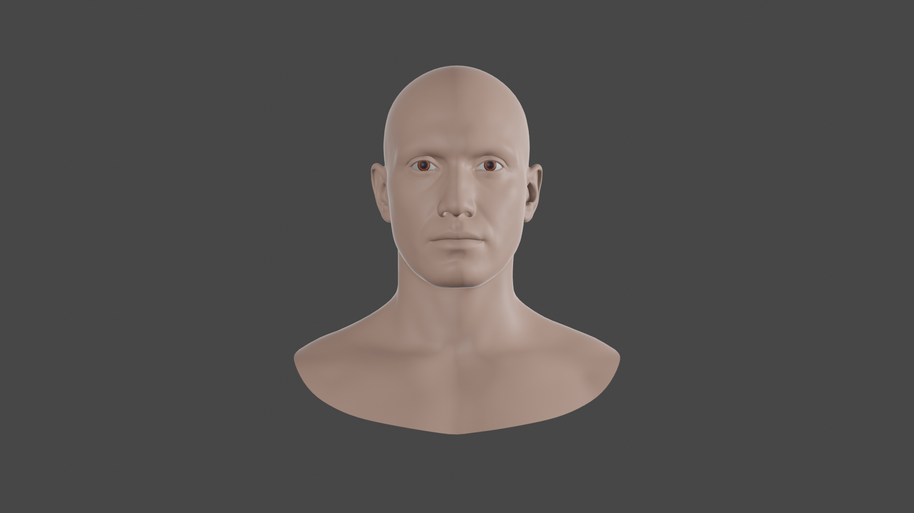

# Blender-ARKit-compatible-heads
Repository containing head meshes with ARKit blendshapes, for facial mocap with Live Link iOS app.

## Usage

You can use the (live link addon)[https://github.com/nmfisher/blender_livelinkface].

There is a fork of that repository for developing stuff (here)[https://github.com/JRicardoSan/blender_livelinkface].

## Heads

### Metahuman head

Originally obtained from [Dragonboots Studios Gumroad](https://dragonboots.gumroad.com/l/metahumanhead?layout=profile). **Important:** Note that they state the following:

**This model is intended for study purposes only.**

So please, remember that still applies for the version offered in this repo with the changes.

Changes made:

- Fixed eyeWideRight blendshape not working in the original version.
- Added materials to add a bit of color.
- Made vertex groups for right eye, tongue and teeth.